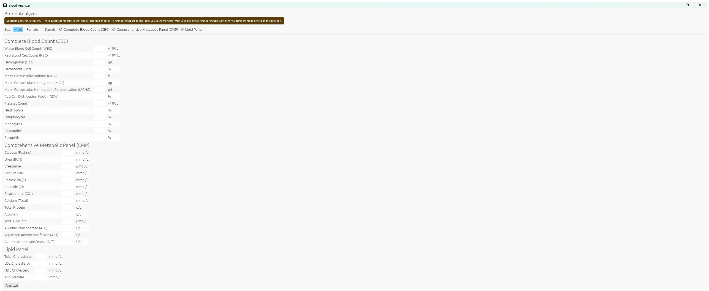
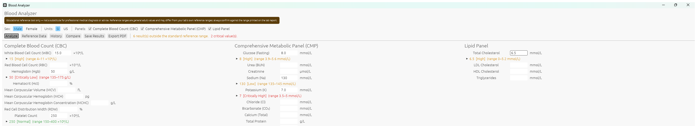
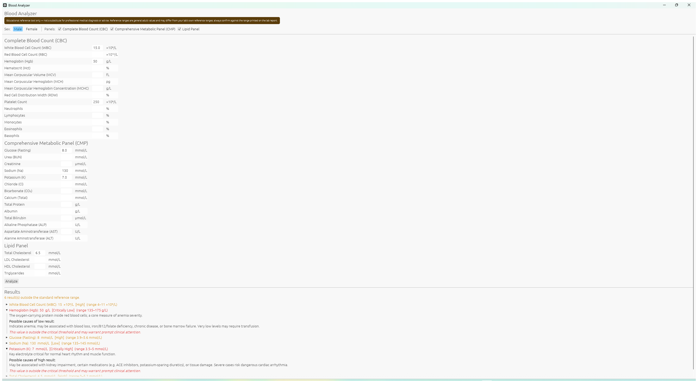
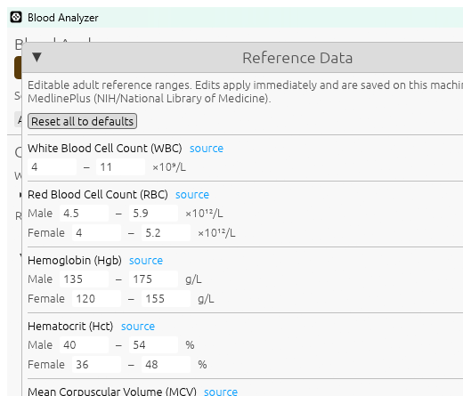
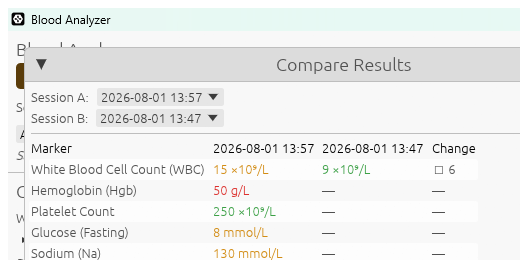
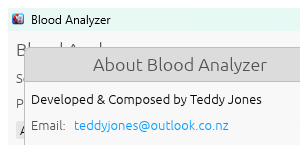

# Blood Analyzer

A Windows desktop tool for entering blood test results and checking them against
adult reference ranges. Flags values outside the normal range, explains what
each marker measures, what could cause a high or low result, links to official
guidance, and can save results over time to compare against each other.

> **Educational reference tool only — not a substitute for professional medical
> diagnosis or advice.** Reference ranges are general adult values and may
> differ from your lab's own reference ranges. Always confirm against the range
> printed on the lab report, and use clinical judgment. Lifestyle notes shown
> alongside abnormal results are general public-health information, not
> individualized medical advice — talk to your doctor.

## Screenshots

**Initial view** — panels laid out as cards that pack tightly with no wasted space, no scrolling needed for the default set:



**Results view** — results appear inline under each field the moment you hit Analyze, color-coded by severity:



**Expanded results** — click a result to see what it measures, possible causes, a lifestyle note, and a link to official guidance:



**Reference Data** — every range is visible and editable, with its source cited:



**Compare** — see two saved result sets side by side, with the change per marker:



**About** — click the logo (top right) for developer credit and the project repository:



## Features

- **64 markers across 11 panels** — CBC, CMP, Lipid, Thyroid, Iron Studies,
  Vitamins, Inflammatory Markers, Coagulation, Hormones, Cardiac Markers, and
  Autoimmune Markers. Panels pack into a masonry-style layout (each column
  stacks its own panels independently) sized from the actual content, so
  nothing gets clipped or leaves large gaps regardless of window size or which
  panels are selected. CBC/CMP/Lipid are shown by default; the rest are opt-in
  via the Panels checkboxes.
- **SI ⇄ US unit toggle** — switch units at any time; already-entered values
  convert automatically
- **Editable reference ranges** — open "Reference Data" to see and adjust any
  range (e.g. to match your lab's own reference interval); edits are saved
  locally and used immediately, with a one-click reset to defaults
- **Save / History / Compare** — save the current entries as a dated snapshot,
  reload past ones, or compare any two side by side to see what changed
- **PDF export** — generate a report of the current results via a native Save
  dialog
- **MedlinePlus links** — every marker links to its official NIH/National
  Library of Medicine reference page
- **Lifestyle notes** — short, non-prescriptive suggestions (sourced from
  public health guidance such as the AHA/CDC/ADA) shown for markers where a
  general tip is responsible to give; deliberately omitted for markers like
  potassium, ANA, or troponin where the right next step is a clinician, not a
  diet tip
- **Custom app icon** — both the window/taskbar icon and the compiled `.exe`
  itself use the project's icon; click the logo in the top-right corner for
  developer credit and a link to the GitHub repository

Reference ranges are given in SI units by default and are sex-specific where
clinically relevant (e.g. hemoglobin, hematocrit, RBC, creatinine, HDL,
testosterone).

## Data storage

The app saves two small local files under `%APPDATA%\BloodAnalyzer\`:

- `history.json` — saved result snapshots (dated, no name/identifier field)
- `range_overrides.json` — any reference ranges you've customized

Nothing is sent anywhere; both files stay on this machine. Delete them (or use
"Reset all to defaults" / delete entries from History) to clear saved data.

## Building and running

Requires the Rust toolchain (install from [rustup.rs](https://rustup.rs) if not
already installed).

```bash
cargo build --release
```

The native executable is produced at `target\release\blood_analyzer.exe`,
with the project icon (`images/blood_analyzer.ico`) embedded in the binary.

To run directly during development:

```bash
cargo run
```

To run the unit test suite (range-boundary, override-resolution, and
history/settings persistence round-trip tests):

```bash
cargo test
```

## Usage

1. Select sex, unit system, and which panels to show.
2. Enter any known values; leave the rest blank.
3. Click **Analyze** (top bar). Results appear inline under each field,
   color-coded (orange = outside range, red = critical), abnormal or not.
4. Click a result to expand it: description, possible causes, a lifestyle
   note where applicable, and a MedlinePlus link.
5. **Reference Data** — view or edit any range; edits apply immediately.
6. **Save Results** — store the current entries as a dated snapshot in
   History. **History** lets you reload or delete past snapshots.
   **Compare** shows any two snapshots side by side with the change per
   marker.
7. **Export PDF** — save a report of the current results.
8. Click the logo (top right) for developer credit and a link to the GitHub
   repository.
